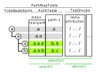

**********************
concept of treepathmap
**********************

The basic task of :mod:`treepathmap` is to create a map of nested collections
and support selection of items via the path (parts) or attached meta attributes.

.. code-block:: python

    nested_sample_data = {
        "shelf": [
            {"banana": {"color": "red", "weight": 123}},
            {"banana": {"color": "blue", "weight": 113}},
        ],
        "table": [
            {"apple": {"color": "green", "weight": 80}},
            {"banana": {"color": "green", "weight": 113}},
            {"apple": {"color": "red", "weight": 81}},
        ]
    }

    sample_map = a_map_method(nested_sample_data)

    # selection of items
    bananas = sample_map.select("banana")

    # read access to of attributes
    banana_weights = bananas.select("weight")
    total_weight_of_all_bananas = numpy.sum(banana_weights.to_list())
    print("Total weight of bananas: {}g".format(total_weight_of_all_bananas))

    # write access of attributes
    bananas.tree_items["color"] = "yellow"

    pretty_print(nested_sample_data)

.. code-block:: console

    Total weight of bananas 349g.
    {
      'shelf': [
        {'banana': {'color': 'yellow', 'weight': 123}},
        {'banana': {'color': 'yellow', 'weight': 113}},
      ],
      'table': [
        {'apple': {'color': 'green', 'weight': 80}},
        {'banana': {'color': 'yellow', 'weight': 113}},
        {'apple': {'color': 'red', 'weight': 81}},
      ]
    }

.. uml::
   :align: center

    @startmindmap
    * tree path map
    ** tree path map item
    *** tree paths
    **** real path
    *****_ index of the path map
    *****_ actual path within nested data
    *****_ contains all items
    **** additional paths
    *****_ multiple occurrence
    *****_ other depiction of nested data
    *****_ not necessary all items
    *** parent node container
    ****_ provides ~__getitem__() method
    ****_ contains item
    *** meta attributes
    ****_ attributes associated with item
    ** selection of items
    ***_ select by path
    ***_ select by meta attributes
    @endmindmap

.. py:module:: treepathmap

The :class:`PathMapItem` points at a specific item within a collection. It attributes
are

.. attribute:: PathMapItem.parent_container -> Collection

    The parent collection of the item, the PathMapItem points to.

.. attribute:: PathMapItem.real_key -> Hashable

    The index of a Sequence or hashable key of a Mapping of the item this PathMapItem
    points to.

.. attribute:: PathMapItem.prime_value : Any

    This is the value of the item

.. attribute:: PathMapItem.real_path : str

    The sequence of indexes and keys pointing at the item's location within the nested
    root collection as a path-like string.

.. attribute:: PathMapItem.meta_attributes

    Attributes associated with the item.

.. uml::
   :align: center

    @startuml
    class PathMapItem {
    path_count
        + parent_container : Collection
        + real_key : Hashable
        + prime_value : Any
        + meta_attributes : dict
        + real_path : str
    }

    @enduml

