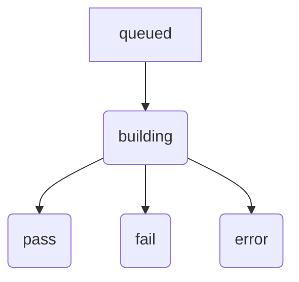
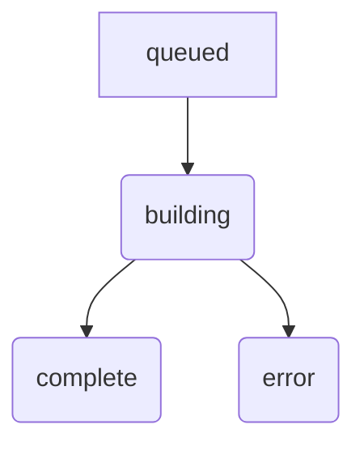

# Build Status

The status API call and status.json file provide the following fields. This
file may also be written out automatically using the `--json-out` cli
parameter. It contains the following fields.

## build_key

(string) The generated build key for the given build.

## build_name

(string) User provided [build name](build-name.md).

## build_status

(string) A single word describing the current status of the build, which
changes as the build proceeds and ends up with one of the terminal statuses.

`queued` - A build is queued until a server and source code are available to
perform the build.

`building` - A build is building while the build is actually being performed.

`pass` - A build completed without errors.

`fail` - A build has completed with one or more errors.

`error` - Something went wrong. See `status_message` for a description
of the error.

## client_token

(string) user-defined string (characters [a-z0-9-]) which is echoed back as a
status field. The tuxsuite client uses this to uniquely identify which build is
which in a build-set.

## download_url

(string) URL to the build artifact location.

## environment

(dictionary) Set of [environmental variables](environment-variables.md) that
were passed into the build.

## errors_count

(integer) Count of errors in build. A build with a count > 0 is considered a
failed build.

## git_describe

(string) The result of running `git describe`.

## git_ref

(string) If provided, the [git ref](git-ref-sha.md) that was requested to be
built.

## git_repo

(string) The url to the git repository.

## git_sha

(string) The full 40-character sha of the build.

## git_short_log

(string) A short string describing the git sha.

## kconfig

(list) The list of kconfig arguments passed to the build.

## kernel_image

(string) If provided, the alternative kernel image requested.

## kernel_version

(string) The output of `make kernelversion`.

## make_variables

(dictionary) The set of [make variables](make-variables.md) that were passed
in.

## status_message

(string) In the event that `tuxbuild_status` is "error", `status_message` will
contain an error description. In the event of a completed build, `status
message` will contain 'build completed'.

## target_arch

(string) The [target architecture](target-architectures.md) that was built.

## targets

(list) The list of [make targets](make-targets.md) that were built, if
specified.

## toolchain

(string) The toolchain that was used to perform the build.

## tuxbuild_status

(string) A single word describing the tuxsuite/infrastructure status of the
build, irrespective of the actual contents and results of the build.

`queued` - A build is queued until a server and source code are available to
perform the build.

`building` - A build is building while the build is actually being performed.

`complete` - There is nothing left to do.

`error` - Something went wrong. See `status_message` for a description of the
error.

## warnings_count

(integer) Count of warnings in build.
